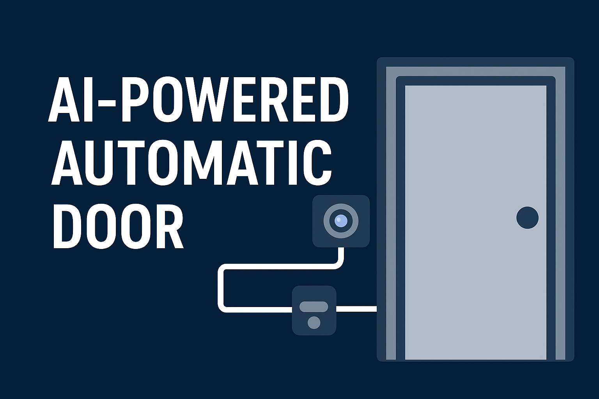

# AI-Powered Automatic Door with Face Recognition  

<div align="center">
  
  
  <br>

  [](https://www.python.org/)
  []()
  [](https://github.com/dorukaysor/truely_basic_face_recognition/graphs/commit-activity)
  [](https://https://github.com/dorukaysor/truely_basic_face_recognition/LICENSE)

</div>

---

## 📌 Overview  
This project implements a **hands-free and secure automatic door system** powered by **AI-based face recognition**.  
The system uses a **Raspberry Pi** for face detection and recognition, while an **Arduino** controls the servo motor and IR sensor for door automation.  

**Workflow:**
1. IR sensor detects presence.  
2. Camera captures the face.  
3. AI model checks against the database of authorized faces.  
4. If recognized → Arduino receives signal → servo opens the door.  
5. After a delay → door closes automatically.  

---

## 🛠️ Components Required  
- **Raspberry Pi 4** (with Camera Module or USB Webcam)  
- **Arduino Uno/Nano**  
- **Servo Motor (SG90/MG996R)**  
- **IR Sensor (HC-SR501)**  
- **Breadboard + Jumper Wires**  
- **Power Supply (5V 3A for Pi, 5V external for servo)**  

---

## 📂 Project Structure

```text
root/ 
│ ├── faces/
│ │ ├── person1_name.jpg
│ │ ├── person2_name.jpg
│ │ └── ...
│ │
│ ├── pi/
│ │ ├── door_face_recognition.py 
│ │ └── requirements.txt 
│ │
│ ├── arduino/
│ │ └── door_control.ino
│ │
│ └── README.md
```

---

## 🚀 Setup  

### 🔹 Raspberry Pi  

1. Update system
```bash
sudo apt update && sudo apt upgrade -y
```

2. Install dependencies
```bash
sudo apt install python3-pip python3-opencv  
pip3 install -r raspberry_pi/requirements.txt
```

3. Run the recognition system:
```bash
python3 raspberry_pi/door_face_recognition.py
```

### 🔹 Arduino

1. Open [`arduino/door_control.ino`](arduino/door_control.ino) in Arduino IDE.

2. Select the correct board and port.

3. Upload the code.

### 🔹 Faces Database

- Place clear face images inside the [`faces/`](faces/) folder.

- **Example:** `faces/person1_name.jpg` → this is an authorized user.

---

## 🔌 Wiring

```text
IR sensor OUT → Arduino D2

Servo signal wire → Arduino D9

Servo +V → 5V external power

Servo GND → Arduino GND + Power supply GND

Arduino → (via USB) → Raspberry Pi

Camera → Raspberry Pi
```

---

## 🌟 Enhancements

- ☁️ Cloud-based face database (Firebase/AWS).

- 📲 Mobile alerts for unknown faces.

- 🔑 RFID/OTP as backup entry.

- 🔋 Battery backup system.

---

## 📜 License

This project is licensed under the [MIT License](LICENSE).
Feel free to modify and use it in your own projects!